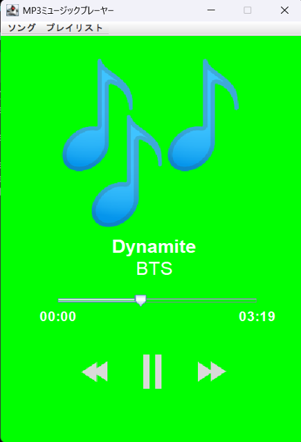

# MP3ミュージックプレーヤー-Java
このアプリは、Java Swing を使用して作成されたシンプルで直感的な MP3ミュージックプレーヤー です。

以下の機能を備えており、MP3音楽ファイルの再生、プレイリストの作成と管理が可能です。


---

## 機能一覧
- ✅ MP3ファイルのロードと再生
- ✅ 再生・一時停止・次の曲・前の曲の操作
- ✅ 再生位置のスライダー操作
- ✅ プレイリストの作成・保存・ロード
- ✅ 曲のタイトル・アーティスト情報の表示
- ✅ 曲の再生時間表示
- ✅ プレイリスト終了後の自動停止
---

## 🛠️ 動作環境
- **JDK:** Java 23(Java 11以上)
- **GUI:** Java Swing
- **ライブラリ:** `jaudiotagger`, `jlayer`, `mp3agic`
---

## 使い方
1. [ソング] → [楽曲をロード] でMP3ファイルを選択し再生開始
2. プレイリストメニュー から複数曲のプレイリストを作成・保存可能
3. 再生位置のスライダーを動かして再生位置を調整
4. 再生・一時停止・前へ・次へボタンで操作
5. プレイリストのロードも可能(保存形式は.txt)

※ プレイリストの保存形式は .txt で、1行ごとにMP3ファイルの絶対パスが記載されます。

## 🚀 実行方法
1. **Javaをインストール**
   
   Java Development Kit(JDK)をインストールしてください。
   
   (最新版のJDKを推奨)

2. **リポジトリのクローン(ダウンロード)**
   
   ターミナルまたはコマンドプロンプトで以下を実行:
   ```sh
   git clone https://github.com/motomasMINO/MP3MusicPlayer-Java.git

   cd MP3AudioPlayer-Java
3. **コンパイル & 実行**
   ```sh
   javac -cp "lib/*" -d out src/*.java

   java -cp "out;lib/*" App
   ```
   ✅ Mac/Linux の場合: out;lib/* → "out:lib/*" に変更

## 📜 ライセンス

このプロジェクトはMIT Licenseのもとで公開されています。

## 📧 お問い合わせ

- **Github: motomasMINO**

- **Email: yu120615@gmail.com**

  バグ報告や改善点・機能追加の提案はPull RequestまたはIssueで受け付けています!
